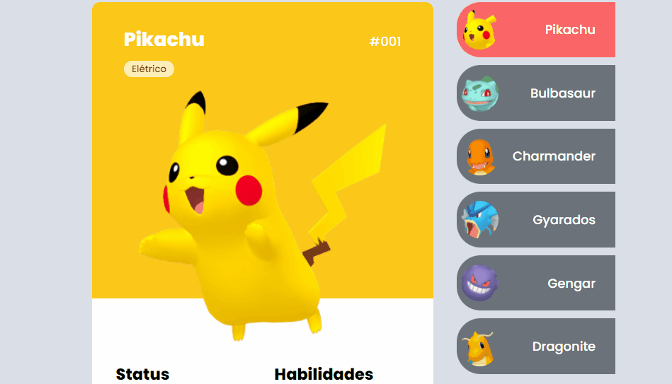

# Projeto Pokédex
Criando uma Pokédex no evento da MapaDev Week 🐱‍🏍

[]

## Tecnologias utilizadas
- HTML
- CSS
- JS

## Como utilizar

1 - Clonar o projeto
```
git clone <url>
```

2 - Acesse a pasta do projeto
```
cd mapadev-week-pokedex
```